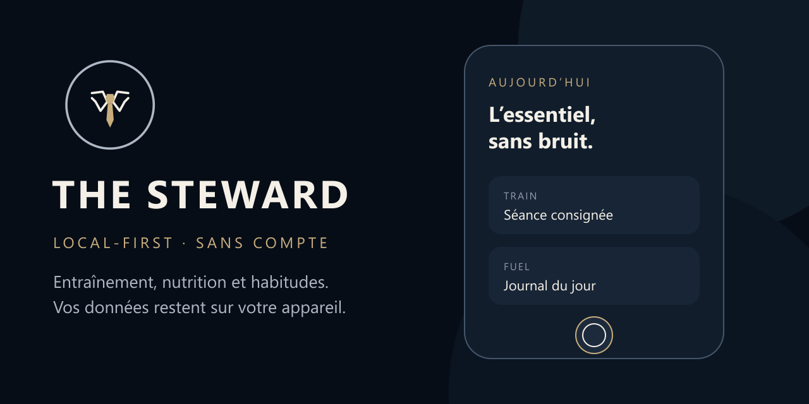
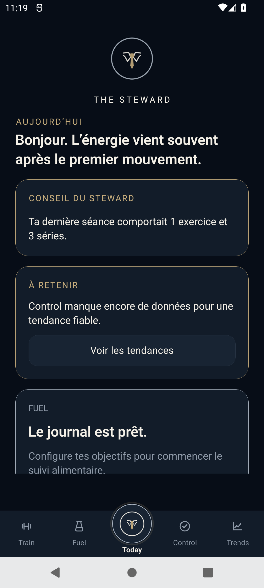
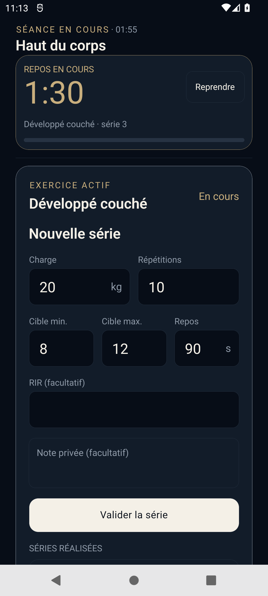
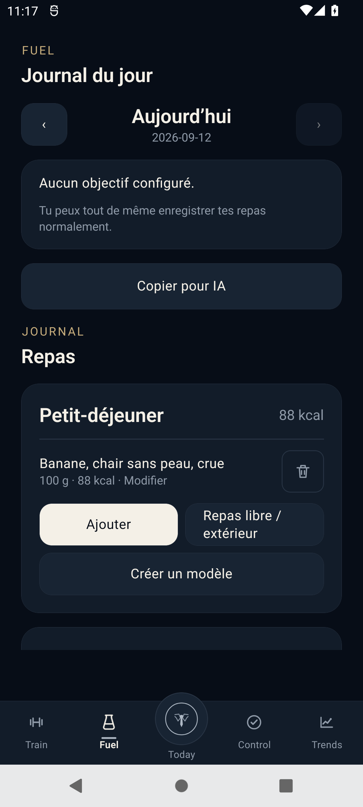
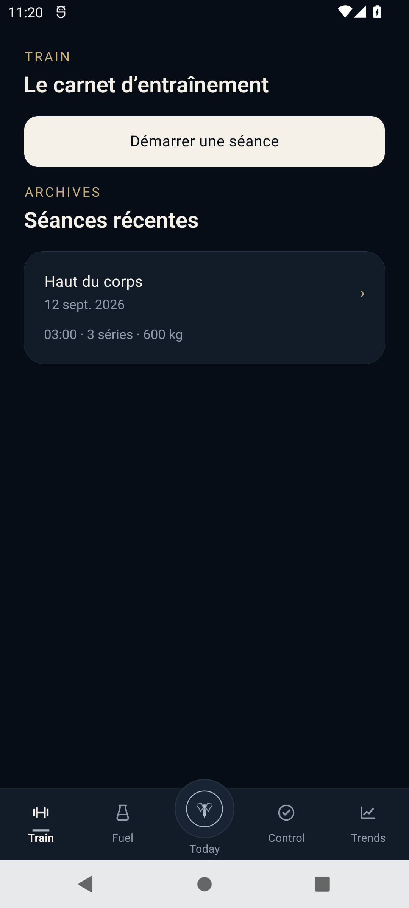
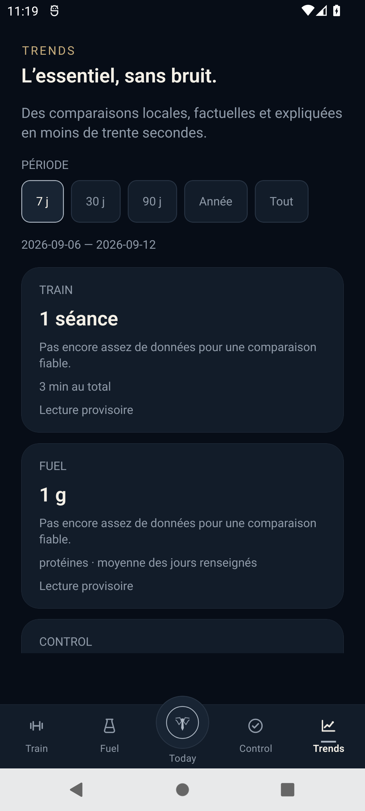

<p align="center">
  
</p>

<h1 align="center">The Steward</h1>

<p align="center">
  Retrouver un équilibre durable grâce à l’entraînement, l’alimentation et la
  réduction des habitudes problématiques — sans compte et sans bruit.
</p>

<p align="center">
  <strong>Pré-bêta Android 0.6.9</strong> · Android 8.0 minimum · Français
</p>

<p align="center">
  <a href="https://github.com/arthas-solutions/the-steward/releases/latest"><strong>Télécharger l’application</strong></a>
  ·
  <a href="https://forms.gle/YFLLpFebckD465vj9"><strong>Devenir bêta-testeur</strong></a>
</p>

## Une application utilisable aujourd’hui, un produit encore en mouvement

The Steward est déjà utilisable au quotidien. Cette publication constitue
l’étape qui précède une bêta fermée sur le Play Store : l’objectif est de réunir
un premier groupe de **15 à 20 utilisateurs pilotes**, d’observer les usages
réels et de corriger les derniers irritants avant cette prochaine étape.

Le développement continue activement. L’APK est proposé gratuitement pour un
usage personnel ; son code source n’est pas publié.

## Retrouver une vie plus saine, à son rythme

The Steward rassemble cinq espaces complémentaires :

- **Today** présente le cockpit de la journée, sans surcharge ;
- **Train** organise les séances de musculation, cardio et cross-training, les
  temps de repos, l’historique et la progression ;
- **Fuel** accompagne l’alimentation, les repas, les objectifs nutritionnels et
  la recherche d’aliments ;
- **Control** aide à réduire ou arrêter plusieurs habitudes problématiques ou
  addictions choisies librement par l’utilisateur ;
- **Trends** synthétise les tendances réellement renseignées, sans transformer
  les données absentes en résultats artificiels.

Control peut suivre plusieurs objectifs en parallèle. Chaque habitude ou
addiction est personnalisable et peut disposer de ses propres événements,
moments de doute, raisons, déclencheurs, stratégies et propositions de prudence.
Le parcours reste discret et sans jugement, tout en donnant accès à des
ressources d’aide lorsque la situation le justifie.

<p align="center">
  
  
  
</p>

<p align="center">
  
  
</p>

> Toutes les captures utilisent exclusivement des données fictives de
> démonstration.

## Participer à la pré-bêta

Tu peux télécharger l’application sans t’inscrire. Si tu souhaites participer
au groupe pilote et être recontacté pour la future bêta Play Store, utilise le
questionnaire suivant :

[**S’inscrire pour devenir bêta-testeur**](https://forms.gle/YFLLpFebckD465vj9)

Les problèmes reproductibles peuvent aussi être signalés dans les
[issues GitHub](https://github.com/arthas-solutions/the-steward/issues). Ne
publie jamais de données personnelles, de sauvegarde `.steward` ou de capture
de l’espace Control.

## Télécharger et vérifier l’APK

Télécharge `the-steward-0.6.9-universal.apk` depuis la
[dernière Release](https://github.com/arthas-solutions/the-steward/releases/latest).

- version : `0.6.9` ;
- Android 8.0 minimum, dont Android 12 ;
- SHA-256 de l’APK : `F690F321033F2245366E3137077DB90133006766B7C56528DFEE0B2F84F55607` ;
- SHA-256 du certificat de signature : `73470031A389162054860565E26ED5A321E547CD56FDE0582A8898A2EBD0C046`.

Vérification sous PowerShell :

```powershell
Get-FileHash -Algorithm SHA256 .\the-steward-0.6.9-universal.apk
```

L’empreinte obtenue doit correspondre exactement à celle publiée ci-dessus et
dans `SHA256SUMS.txt`.

## Installation et mise à jour

Ouvre l’APK téléchargé sur l’appareil. Android peut demander d’autoriser
temporairement l’installation depuis le navigateur ou le gestionnaire de
fichiers utilisé.

Pour mettre à jour sans perdre les données, installe la nouvelle version
par-dessus l’ancienne. **Ne désinstalle pas l’application avant une mise à
jour** : une désinstallation Android efface normalement ses données locales.
Une sauvegarde chiffrée préalable reste recommandée.

Installation avec ADB :

```powershell
adb install -r "the-steward-0.6.9-universal.apk"
```

## Local-first et confidentialité

- aucune création de compte ;
- aucune publicité ou télémétrie ;
- données métier conservées dans une base SQLite chiffrée ;
- sauvegardes locales chiffrées ;
- aucun envoi automatique vers une intelligence artificielle ;
- accès facultatif à Health Connect et Open Food Facts uniquement pour les
  fonctions concernées.

Les captures d’écran sont bloquées dans Control, mais restent possibles dans
Today, Train, Fuel et Trends. Consulte [PRIVACY.md](PRIVACY.md) pour le détail.

## À propos de la santé et des addictions

The Steward est un outil d’organisation et de suivi personnel. Il ne pose aucun
diagnostic, ne constitue pas un dispositif médical et ne remplace pas un
professionnel de santé, un service spécialisé ou les services d’urgence.

## Licence

L’utilisation personnelle et non commerciale d’une copie officielle est
gratuite. The Steward reste un logiciel propriétaire : la redistribution, la
modification, l’ingénierie inverse, les clones et la réutilisation du nom, du
logo ou de l’identité visuelle ne sont pas autorisés, sous réserve des droits
impératifs prévus par la loi.

Le texte complet applicable figure dans [LICENSE.txt](LICENSE.txt). Les
composants et données de tiers conservent leurs propres conditions, listées dans
[THIRD_PARTY_NOTICES.md](THIRD_PARTY_NOTICES.md).

Les vulnérabilités doivent être signalées conformément à
[SECURITY.md](SECURITY.md).

Contact : contact@arthas.fr
